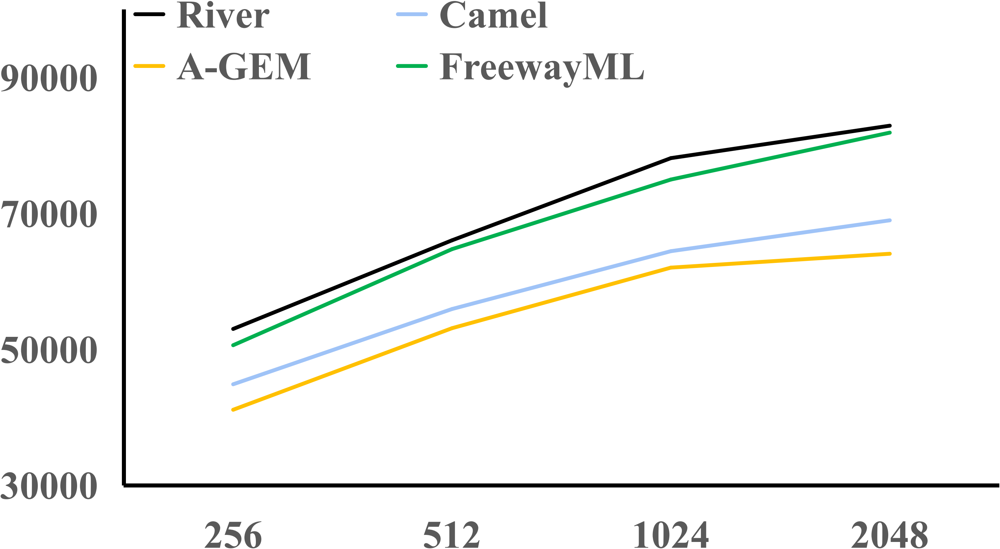

# FreewayML

This is the code repository for *FreewayML*. 

## Abstract

​    Streaming (machine) learning (SML) can capture dynamic changes in real-time data and perform continuous updates. It has been widely applied in real-world scenarios such as network security, financial regulation, and energy supply. However, due to the sensitivity and lightweight nature of SML models, existing work suffers from low robustness, sudden decline, and catastrophic forgetting when facing unexpected data distribution drifts. Previous studies have attempted to enhance the stability of SML through methods such as data selection, replay, and constraints. However, these methods are typically designed for specific feature spaces and specific ML algorithms.
​    In this paper, we introduce a shift graph based on the distances between data distributions and define three distinct data distribution shift patterns. For these three patterns, we design three adaptive mechanisms, (a) multi-time granularity models, (b) coherent experience clustering, and (c) historical knowledge reuse, that are triggered by a strategy selector, with the goal of enhancing the accuracy and stability of SML. We implement an adaptive and stable SML system, FreewayML, on top of PyTorch, which is suitable for most SML models. Experimental results show that FreewayML significantly outperforms existing SML systems in both stability and accuracy, with a comparable throughput and latency.


## Test Dataset

​    We conducted tests on these 6 datasets, which include two synthetic datasets, **Hyperplane** and **SEA**, as well as four real-world datasets **Airlines**, **CoverType**, **NSL-KDD**, and **Electricity**:

​    We obtained the original dataset from the official site and performed some preprocessing to convert all data into a numerical format that can be easily processed by the model.

​    The description for each dataset is listed below:

| Dataset     | Link                                                         | Detailed information                                         |
| ----------- | ------------------------------------------------------------ | ------------------------------------------------------------ |
| Hyperplane  | https://riverml.xyz/0.14.0/api/datasets/synth/Hyperplane/    | Hyperplane is a synthetic dataset with hyperplane of continuously changing position and orientation. It allows control over the degree of plane rotation through parameters to assess whether streaming learning can effectively adapt to new data distributions. |
| SEA         | https://riverml.xyz/0.14.0/api/datasets/synth/SEA/           | SEA is a synthetic dataset identifying different types of data with cumulative value of features. |
| Airlines    | https://www.kaggle.com/datasets/saadharoon27/airlines-dataset | Airlines comprises diverse parameters related to airline operations at a global scale. Researchers and industry experts can leverage this dataset to analyze trends in passenger behavior. |
| CoverType   | https://archive.ics.uci.edu/dataset/31/covertype             | CoverType contains tree observations from four areas of the Roosevelt National Forest in Colorado. All observations are cartographic variables from 30 meter $\times$ 30 meter sections of the forest. |
| NSL-KDD     | https://www.unb.ca/cic/datasets/nsl.html                     | NSL-KDD is a version dataset of the KDD'99 dataset. This is an effective benchmark dataset to help researchers compare accuracy of different streaming learning tools. |
| Electricity | https://riverml.xyz/dev/api/datasets/Elec2/                  | Electricity was collected from the Australian New South Wales Electricity Market. In this market, prices are not fixed and are affected by demand and supply of the market |

## Run

```sh
python main.py <path to your data file>
```

The \<path to your data file> argument should be the directory path where the dataset are located.

## Results

### Accuracy of FreewayML

| Model            | Frameworks  | Hyperplane | SEA        | Airlines   | Covertype  | NSL-KDD    | Electricity |
| ---------------- | ----------- | ---------- | ---------- | ---------- | ---------- | ---------- | ----------- |
| **StreamingLR**  | Flink ML    | 81.51%     | 82.54%     | 62.17%     | 58.78%     | 80.72%     | 77.54%      |
|                  | Spark MLlib | 81.74%     | 82.68%     | 62.30%     | 59.12%     | 80.98%     | 77.27%      |
|                  | Alink       | 83.25%     | 82.02%     | 63.08%     | 58.61%     | 82.04%     | 78.12%      |
|                  | FreewayML   | **88.69%** | **84.62%** | **65.12%** | **62.46%** | **86.52%** | **81.38%**  |
| **StreamingMLP** | River       | 81.14%     | 82.06%     | 62.28%     | 62.57%     | 81.43%     | 83.11%      |
|                  | Camel       | 84.82%     | 82.14%     | 64.37%     | 63.85%     | 82.21%     | 83.57%      |
|                  | A-GEM       | 84.60%     | 81.98%     | 64.54%     | 62.14%     | 82.38%     | 83.33%      |
|                  | FreewayML   | **88.47%** | **84.80%** | **66.70%** | **65.78%** | **87.10%** | **85.91%**  |

​    We evaluate the two models, StreamingLR and StreamingMLP, across the six datasets. Table above summarizes the results, where the best-performing methods have been highlighted. We observe that FreewayML outperforms existing methods in terms of accuracy.

### Effectiveness of FreewayML

​    We investigate the effectiveness of our proposed mechanisms across the three data distribution shift patterns as table below shows. To evaluate the improvements brought by FreewayML across all the six datasets, we list the improvement in accuracy of each shift pattern compared with original Streaming MLP. This underscores the effectiveness of our mechanisms. For most of the time, data streams meet slight shifts, and multi-time granularity models enhance stability.  The coherent experience clustering and historical knowledge reuse mechanisms improve accuracy in specific data scenarios and mitigate potential severe issues.

| Dataset         | Slight Shifts | Severe Shifts | Retrieval Shifts |
| --------------- | ------------- | ------------- | ---------------- |
| **Hyperplane**  | 5.7%          | 34.1%         | 59.3%            |
| **SEA**         | 2.1%          | 10.5%         | 57.8%            |
| **Airlines**    | 3.8%          | 8.6%          | 17.7%            |
| **Covertype**   | 2.6%          | 11.7%         | 16.8%            |
| **NSL-KDD**     | 4.4%          | 28.5%         | 41.0%            |
| **Electricity** | 2.3%          | 5.1%          | 18.9%            |

​    As shown in figure below, the **dashed** line represents the baseline version of the Streaming MLP, and the three **solid** lines with different colors represent the corresponding optimization mechanisms. Among them, multi-time granularity models enhance overall stability and accuracy for the majority of instances, while coherent experience clustering and historical knowledge reuse also exhibit significant improvements of accuracy in the presence of severe shifts and retrieval shifts. This demonstrates that our three mechanisms indeed perform well across the distribution shift patterns.

|                  (a) Mechanisms on Airlines                  |                 (b) Mechanisms on CoverType                  |
| :----------------------------------------------------------: | :----------------------------------------------------------: |
|  |  |
|                **(c) Mechanisms on NSL-KDD**                 |              **(d) Mechanisms on Electricity**               |
|  |  |

​    Moreover, we compare FreewayML's performance on these three shift patterns against that of existing frameworks.  Given the varying ratio of the three patterns across the datasets, we focus our evaluation on top of the four real-world datasets, each characterized by distinct shift patterns. 

|       (a) FreewayML on Airlines        |    (b) FreewayML on CoverType    |
| :------------------------------------: | :------------------------------: |
|  |    |
|      **(c) FreewayML on NSL-KDD**      | **(d) FreewayML on Electricity** |
|          |    |

### Performance of FreewayML

​    From a performance perspective, our primary concerns with streaming learning frameworks are throughput and latency metrics. To evaluate throughput and latency, we employ the same algorithm to first infer and then train on the simulated dataset, **Hyperplane**.  The most critical performance-relevant parameter identified is the batch size.  Consequently, we investigate how performance varies with different batch sizes.

​    Regarding latency, we divide the computing tasks into inference and update phases, which are characterized by distinct computational complexities and communication costs. We further categorize the models into Streaming Logistic Regression and Streaming MLP, as detailed in table below. The batch size is set to ranging from 512 to 4,096, as smaller batch size typically yields lower inference latency, which is challenging to measure accurately due to fluctuations in network communication speed.

| Size of batch  | Frameworks  |   512    |   1024   |   2048    |   4096    |
| :------------: | :---------: | :------: | :------: | :-------: | :-------: |
| **LR_update**  |  Flink ML   |   4500   |   8350   |   15960   |   31340   |
|                | Spark MLlib |   5320   |  10230   |   20060   |   39610   |
|                |    Alink    |   4800   |   8540   |   16100   |   31500   |
|                |  FreewayML  | **3460** | **6460** | **11880** | **22530** |
| **MLP_update** |    River    |   5110   |   8690   |   16500   |   31780   |
|                |    Camel    |   6040   |  10580   |   19600   |   37640   |
|                |    A-GEM    |   6360   |  10910   |   21190   |   42270   |
|                |  FreewayML  | **5210** | **9010** | **16540** | **31850** |
|  **LR_infer**  |  Flink ML   |   510    |   920    |   1780    |   3470    |
|                | Spark MLlib |   590    |   1140   |   2230    |   4410    |
|                |    Alink    |   530    |   950    |   1800    |   3510    |
|                |  FreewayML  | **390**  | **720**  | **1320**  | **2500**  |
| **MLP_infer**  |    River    |   2560   |   4320   |   8170    |   15780   |
|                |    Camel    |   3030   |   5290   |   9890    |   18900   |
|                |    A-GEM    |   3180   |   5440   |   10550   |   20640   |
|                |  FreewayML  | **2610** | **4510** | **8290**  | **15920** |

​    Regarding throughput, we vary the batch size from 256 to 2,048 to assess performance variations with prequential evaluation as figure below shows. 
For linear models, it is evident that FreewayML substantially outperforms other frameworks.

| (a) Performance of StreamingLR | (b) Performance of StreamingMLP |
| :----------------------------: | :-----------------------------: |
|    |   |
